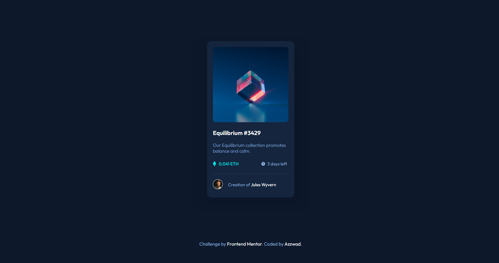

## Table of contents

- [Overview](#overview)
  - [The challenge](#the-challenge)
  - [Screenshot](#screenshot)
  - [Links](#links)
- [My process](#my-process)
  - [Built with](#built-with)
  - [What I learned](#what-i-learned)
  - [Continued development](#continued-development)
  - [Useful resources](#useful-resources)
- [Author](#author)
- [Acknowledgments](#acknowledgments)

## Overview
  **This Is a Solution For The Frontend Mentor NFT-Preview Card Component Project.**
### The challenge

Users should be able to:

- View the optimal layout depending on their device's screen size
- See hover states for interactive elements

### Screenshot




### Links

- Solution URL: [Add solution URL here](https://your-solution-url.com)
- Live Site URL: [Add live site URL here](https://your-live-site-url.com)

## My process
- Used Basic CSS.
- Used ```::before``` And ```::after``` For Animations And Styling.
### Built with

- Semantic HTML5 markup
- CSS custom properties


### What I learned

In This Project I Learned About 2 Things:

- CSS ```::before``` And ```::after``` Pseudo Elements.
- CSS Transitions.

### Continued development

I'd Like To Learn More About CSS Grids And CSS Transforms And Have A Decent Understanding On Flexbox 


### Useful resources

- [Frontend Mentor Solution Page](https://www.frontendmentor.io/solutions) - I Got Some Inspirations From Here And Understood What To Do.
- [Kevin Powell's Youtube Channel](https://www.youtube.com/@KevinPowell) - I Learned About CSS ```::before```,```::after``` Pseudo Elements And Transitions From This Generous Guy

## Author

- Frontend Mentor - [@Azzwad](https://www.frontendmentor.io/profile/Azzkid)

## Acknowledgments

Kevin Powell's Youtube Channel.


